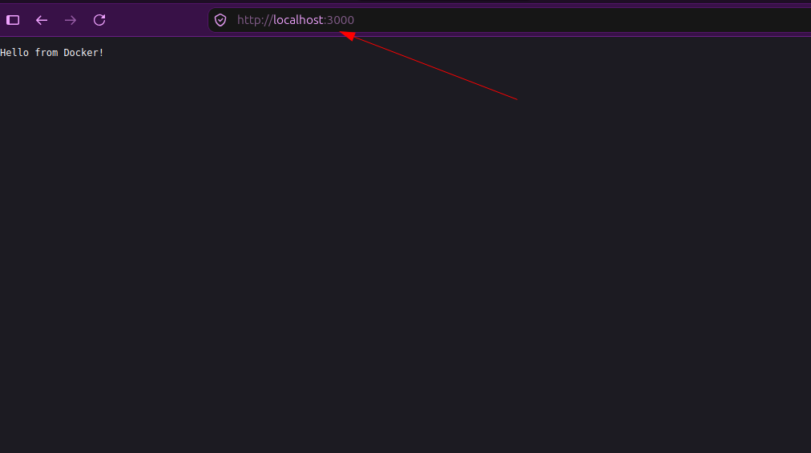

# Docker: Node.js HTTP Server in a Container

## 1. What I Built

A small Node.js web server, packaged and run inside a Docker container.

- The server listens on port 3000.
- When you visit it in a browser, it replies: `Hello from Docker!`
- The whole thing is packaged with Docker, so it runs the same way on any computer.

**Files in this project:**
- `README.md` — this file, explaining everything I did
- `app.js` — the server code
- `package.json` — Node.js project configuration
- `Dockerfile` — instructions Docker uses to build the image
- `docker-interview-questions.md` — Q&A for interview prep (see [section 10](#10-interview-questions))

---

## 2. app.js — The Server Code

```javascript
const http = require('http');

http.createServer((req, res) => {
  res.writeHead(200, {'Content-Type': 'text/plain'});
  res.end('Hello from Docker!\n');
}).listen(3000, () => {
  console.log('Server running on port 3000');
});
```

**Line by line, in plain English:**

- `require('http')` — Load Node's built-in HTTP module. HTTP is the protocol browsers and servers use to talk to each other. Without it, this code has no way to understand web requests.
- `http.createServer((req, res) => {...})` — Create a server. Every time someone visits it, this function runs.
  - `req` = the request — what the browser is asking for.
  - `res` = the response — what the server sends back.
- `res.writeHead(200, {'Content-Type': 'text/plain'})` — Send the response headers first.
  - `200` is the HTTP status code for "OK, success."
  - `'Content-Type': 'text/plain'` tells the browser "what I'm sending you is plain text, not HTML or JSON."
- `res.end('Hello from Docker!\n')` — Send the actual message and close the connection.
- `.listen(3000, () => {...})` — Start listening for requests on port 3000. The small function just prints a message to the terminal once the server is up.

**Important idea:** This one file acts as both a *web server* (it listens for requests) and an *app server* (it runs logic and builds a response). Small apps combine both jobs. Bigger apps (like Netflix or Facebook) split them apart so each part can scale on its own.

---

## 3. package.json — Node.js Configuration

```json
{
  "name": "docker-hello-app",
  "version": "1.0.0",
  "description": "Simple Docker app - Hello from Docker",
  "main": "app.js",
  "scripts": {
    "start": "node app.js"
  },
  "keywords": ["docker", "nodejs", "http"],
  "author": "Abhigna",
  "license": "MIT"
}
```

**What each field means:**

| Field | Meaning |
|---|---|
| `name` | The name of the app |
| `version` | Version number (1.0.0 = first release) |
| `description` | Short description of what it does |
| `main` | The entry-point file (`app.js`) |
| `scripts.start` | Lets you run `npm start` instead of typing `node app.js` |
| `keywords` | Tags, useful for searching |
| `author` | Who made it |
| `license` | MIT = open-source license |

**Why bother with this file if the app has no dependencies?**
Docker's build process runs `npm install`, and `npm install` needs `package.json` to exist. It's also just standard practice — every real Node.js project has one, and it's where dependencies (like `express`) would be listed if we needed any.

---

## 4. Dockerfile — Build Instructions

```dockerfile
FROM node:16-alpine
WORKDIR /app
COPY . .
RUN npm install
EXPOSE 3000
CMD ["node", "app.js"]
```

Each line is one instruction, run in order, when Docker builds the image.

### `FROM node:16-alpine`
Start from an existing image that already has Node.js version 16 installed. "Alpine" is a very small, lightweight version of Linux, which keeps the final image small.
> Think of it as: "Start with a computer that already has Node.js on it."

### `WORKDIR /app`
Create a folder called `/app` inside the container and make it the current working folder. Every instruction after this happens inside `/app`.
> Think of it as: "cd into a project folder" — except Docker creates that folder for you.

### `COPY . .`
This is the important one. It copies files from **your laptop** into **the container**.
- First `.` = current folder on your laptop (where `app.js`, `package.json`, `Dockerfile` are)
- Second `.` = current folder inside the container (which is `/app`, because of `WORKDIR`)

Without this line, the container would be completely empty — no code to run at all. This line is what gets your code *inside* the box.

### `RUN npm install`
Runs `npm install` **inside the container** (not on your laptop). It reads `package.json` and installs any dependencies listed there, creating a `node_modules` folder. In this project there are no dependencies, so it finishes almost instantly — but it's a required step for any real Node.js app.

### `EXPOSE 3000`
This just documents that the app inside the container listens on port 3000. It does **not** actually open the port to the outside world — that happens later, when we run the container with `-p`.

### `CMD ["node", "app.js"]`
The default command that runs automatically when a container starts from this image. It's equivalent to typing `node app.js` yourself.
> Think of it as: "when this container starts, run this."

---

## 5. Building the Image

```bash
docker build -t my-app:1.0 .
```

- `docker build` — build an image
- `-t my-app:1.0` — tag (name) it `my-app`, version `1.0`
- `.` — look in the current folder for the `Dockerfile`

**What happens step by step:**
1. Docker downloads the `node:16-alpine` base image (only the first time — after that it's cached).
2. It creates the `/app` folder.
3. It copies your files (`app.js`, `package.json`) into the container.
4. It runs `npm install` inside the container.
5. It records the port and startup command.
6. It saves the final result as an image called `my-app:1.0`, stored on your laptop.

**Check it worked:**
```bash
docker images | grep my-app
```
You should see `my-app` listed with tag `1.0` and a size (usually around 100–150MB).

---

## 6. Running the Container

```bash
docker run -p 3000:3000 my-app:1.0
```

- `docker run` — create and start a container from an image
- `-p 3000:3000` — port mapping: **laptop port 3000 → container port 3000**
- `my-app:1.0` — which image to use

When this runs, you should see in the terminal:
```
Server running on port 3000
```
That means the container is alive and the server started. **Keep this terminal open** — closing it stops the container.

**Check it's running (from a second terminal):**
```bash
docker ps
```

**Stop it:**
Press `Ctrl+C` in the terminal running the container.

---

## 7. Testing in the Browser

Visit:
```
http://localhost:3000
```

**What happens, step by step:**
1. The browser sends a request to `localhost:3000` (your laptop).
2. Docker's port mapping forwards that request to port 3000 *inside* the container.
3. The Node.js server inside the container receives it and runs the response code.
4. It sends back `Hello from Docker!`
5. The browser displays it.

If you see that text, everything worked end to end — code, image, container, and network mapping.

**What I actually saw in the browser:**



The address bar shows `http://localhost:3000` and the page just prints `Hello from Docker!` — plain text, no HTML, exactly what `res.end('Hello from Docker!\n')` in `app.js` sends back.

---

## 8. Big Ideas to Remember

### Image vs. Container
- **Image** = a blueprint. It doesn't run by itself; it's just stored on disk.
- **Container** = a running instance of an image — the actual live process.
- Analogy: image is a recipe, container is the cooked meal. You can make many containers (meals) from one image (recipe).

### COPY . . is the bridge between laptop and container
Before `COPY`, your code only exists on your laptop. After `COPY`, an identical copy of it exists inside the container's filesystem. The container never reaches back out to your laptop to grab files while it's running — everything it needs was copied in at build time.

### Port mapping (`-p 3000:3000`)
The two numbers don't have to match. `-p 8080:3000` would mean: laptop port 8080 → container port 3000, and you'd visit `http://localhost:8080` instead. The first number is always "your machine," the second is always "inside the container."

### Why Docker matters
Docker packages the app *and* everything it needs (Node.js runtime, dependencies, OS tools) into one image. That image behaves exactly the same on your laptop, a teammate's laptop, or a production server — which solves the classic "it works on my machine" problem.

### Real-world version of this workflow
1. Developer writes the app code.
2. Someone writes a `Dockerfile`.
3. A CI/CD pipeline runs `docker build` and pushes the image to a registry (Docker Hub, AWS ECR, etc.).
4. A production server pulls that image and runs it with `docker run`.
5. Users access the app over the internet.

Same steps I did locally — just automated and pointed at the cloud instead of `localhost`.

---

## 9. Next Steps

- Kubernetes — running and managing many containers together
- Terraform — provisioning cloud infrastructure as code
- CI/CD (Jenkins/GitHub Actions) — automating build and deploy
- Docker Compose — running multiple containers together (e.g. app + database)

---

## 10. Interview Questions

All interview prep for this project lives in a separate file:

👉 [`docker-interview-questions.md`](docker-interview-questions.md)

It has 20 Q&A entries covering images vs. containers, `COPY`, port mapping, `Dockerfile` instructions, and how this workflow maps to real production deployments — all based on the exact project explained above.
